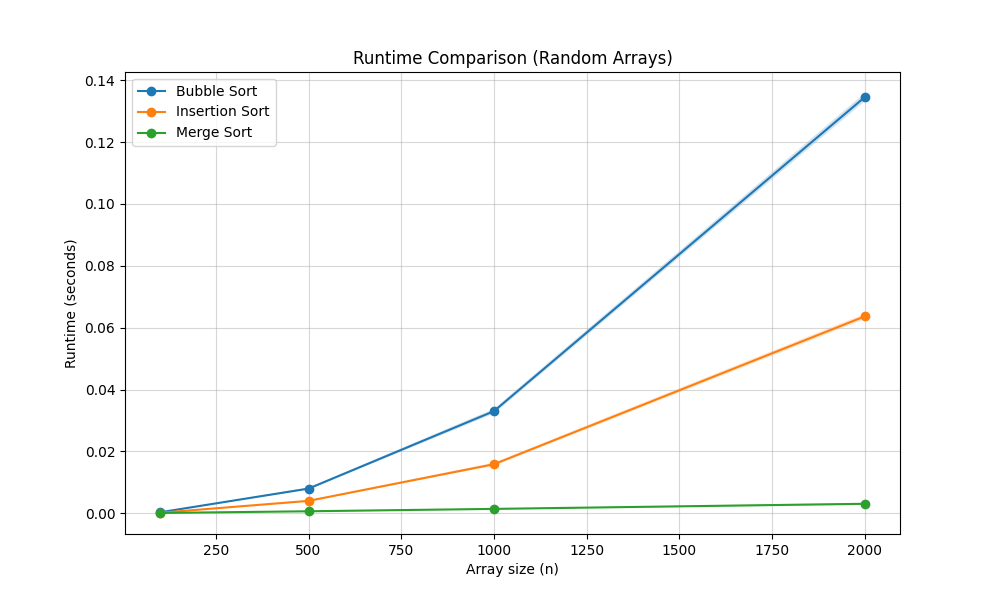
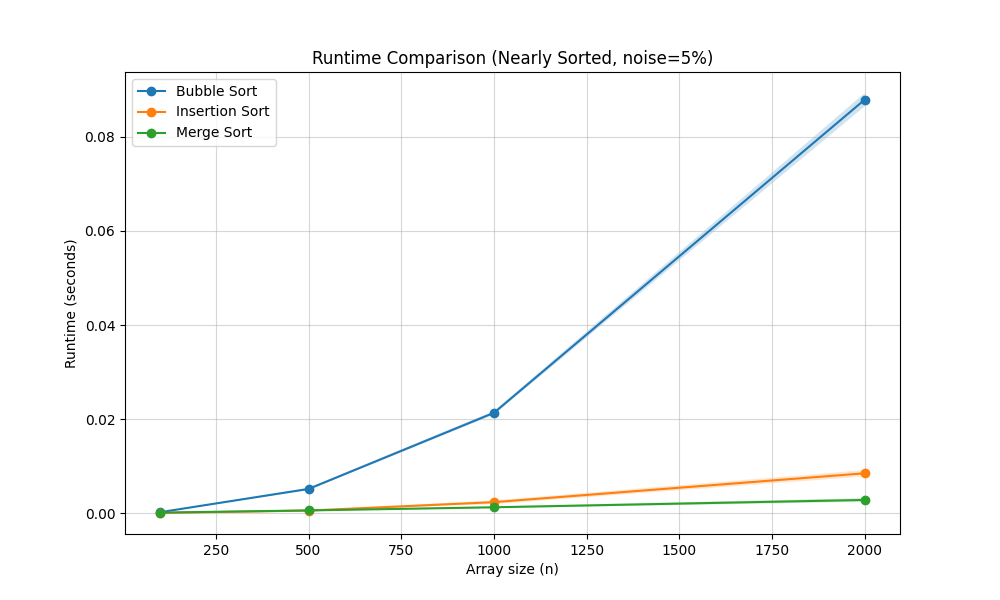

# Sorting_Assignment
Data Structures Course Mini-Project: Evaluating efficiency and complexity of different sorting algorithms.

Sorting Algorithms Efficiency Analysis :  

##Student Names : Guy Gvir 209466929 
                  Karolina Melnichak 211658554

**Algorithms Implemented:** Bubble Sort, Insertion Sort, and Merge Sort.  

## Experiment 1: Random Arrays (result1.png) 

  

  Merge Sort demonstrated superior performance (significantly lower running time) due to its $O(n \log n)$ complexity, while Bubble Sort and Insertion Sort exhibited quadratic growth ($O(n^2)$). For very small array sizes,     their performance is quite similar. However, Insertion Sort is faster than Bubble Sort because it has a lower constant factor; while Bubble Sort requires multiple 'swaps' (each involving three assignments),                   Insertion Sort uses a more efficient 'shifting' mechanism that requires only a single assignment per move .  

## Experiment 2: Nearly Sorted Arrays with 5% Noise (result2.png) 

   

  We can observe that Insertion Sort's performance approaches that of Merge Sort in this experiment. This is because Insertion Sort best-case complexity is $O(n)$; when the array is nearly sorted (5% noise), it requires        very few shifts to reach a sorted state. In contrast, Bubble Sort remains significantly slower because it is less efficient at handling even minor inversions. Even with low noise, Bubble Sort may still require numerous       passes and a high volume of expensive 'swaps' to move misplaced elements to their correct positions.   

  
  
